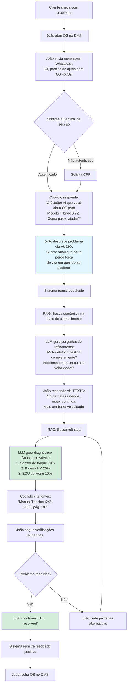
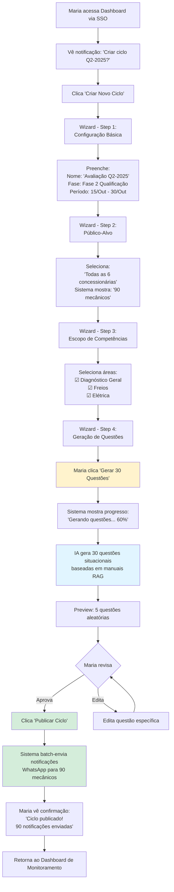
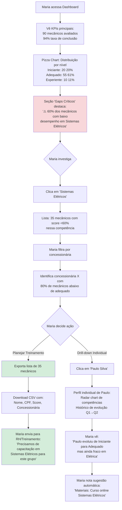
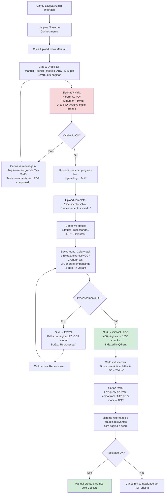

# CarGuroo UX/UI Specification

_Generated on 2025-10-10 by Allan_

## Executive Summary

O **CarGuroo** é uma plataforma SaaS B2B de IA generativa que transforma o pós-venda automotivo através de dois produtos integrados: **Copiloto do Mecânico** (assistente conversacional via WhatsApp) e **Sistema de Avaliação** (mapeamento de competências baseado em metodologias científicas).

**Escala do MVP**: 450 mecânicos e 30 concessionárias (cliente piloto confirmado)

**Desafios de UX Únicos**:
- **Dualidade de Interfaces**: WhatsApp conversacional para mecânicos (mobile-first, hands-free) vs. Web dashboard para gestores (desktop, data-heavy)
- **Contexto de Uso Extremo**: Mecânicos usam com mãos sujas, em movimento, em ambiente de oficina ruidoso
- **Inclusão Digital**: Variação grande de letramento digital entre usuários (júnior vs. sênior, idade, escolaridade)
- **Criticidade Operacional**: Erros de UX impactam diretamente tempo de reparo e qualidade de serviço ao cliente final

**Princípio Orientador**: "Invisibilidade da Tecnologia" - O sistema deve ser tão intuitivo que mecânicos o usem como extensão natural de seu trabalho, sem perceber a complexidade técnica subjacente.

---

## 1. UX Goals and Principles

### 1.1 Target User Personas

#### Persona 1: João - Mecânico Pleno

**Demografia**:
- Idade: 32 anos
- Experiência: 5 anos em concessionária
- Escolaridade: Ensino médio completo + curso técnico
- Classificação: Adequado (sistema de avaliação)

**Contexto de Trabalho**:
- Atende 4-6 veículos por dia
- Trabalha principalmente sozinho, mas consulta colegas quando necessário
- Usa smartphone pessoal (Android) para WhatsApp regularmente
- Familiaridade média com tecnologia

**Dores com Sistema Atual**:
- "Quando pego um problema que nunca vi, perco muito tempo procurando no manual em PDF ou esperando resposta do help desk."
- "Já aconteceu de não achar a informação e tentar por tentativa e erro... o carro voltou."

**Objetivos com CarGuroo**:
- Reduzir tempo de diagnóstico em casos complexos
- Aumentar confiança ao lidar com modelos novos
- Evitar retrabalho e retorno de clientes

**Comportamento Esperado**:
- Usa Copiloto durante execução de serviços (10-15 consultas por dia)
- Prefere áudio a texto quando mãos estão sujas
- Completa avaliações trimestrais (30 questões)

---

#### Persona 2: Maria - Gestora Regional

**Demografia**:
- Idade: 45 anos
- Cargo: Gestora de pós-venda regional
- Escopo: 6 concessionárias, 90 mecânicos
- Escolaridade: Superior completo (Administração)

**Contexto de Trabalho**:
- Trabalha em escritório, laptop + monitor externo
- Precisa reportar performance para diretoria mensalmente
- Não tem visibilidade clara de competências individuais dos mecânicos
- Planeja capacitações baseado em intuição, não dados

**Dores com Sistema Atual**:
- "Não sei quais mecânicos são bons em quê. Só descubro quando há problema."
- "Treinamentos são genéricos porque não sei o gap real de cada um."

**Objetivos com CarGuroo**:
- Mapear competências de 90 mecânicos em tempo real
- Identificar gaps críticos para direcionar capacitação
- Demonstrar evolução da equipe para diretoria com dados

**Comportamento Esperado**:
- Cria ciclos de avaliação trimestrais
- Acessa dashboard 3-5x por semana
- Faz drill-down em mecânicos específicos quando necessário
- Exporta relatórios para apresentações

---

#### Persona 3: Paulo - Mecânico Júnior

**Demografia**:
- Idade: 24 anos
- Experiência: 18 meses em concessionária
- Classificação: Iniciante (sistema de avaliação)
- Escolaridade: Ensino médio + aprendizagem técnica

**Contexto de Trabalho**:
- Ainda em curva de aprendizado
- Depende muito de mecânicos sênior para diagnósticos complexos
- Inseguro com problemas que nunca viu
- Ansioso para evoluir e ser reconhecido

**Dores com Sistema Atual**:
- "Tenho medo de perguntar demais pros mecânicos mais velhos, parece que tô incomodando."
- "Quando não sei algo, fico travado. Às vezes demoro muito por não querer pedir ajuda."

**Objetivos com CarGuroo**:
- Ter fonte confiável de informação sem "incomodar" colegas
- Ver sua evolução ao longo do tempo (motivação)
- Saber o que precisa estudar para melhorar

**Comportamento Esperado**:
- Usa Copiloto intensamente (20-30 consultas por dia)
- Completa avaliações com expectativa de feedback construtivo
- Busca materiais de estudo sugeridos pelo sistema

### 1.2 Usability Goals

**Goal 1: Redução Cognitiva para Mecânicos em Ação**
- **Métrica**: Mecânico consegue obter resposta relevante em <3 interações (média)
- **Rationale**: Contexto de uso hands-free exige respostas diretas, não diálogos longos
- **Validação**: Teste de usabilidade com 5 mecânicos em ambiente real de oficina

**Goal 2: Adoção Sem Treinamento Formal**
- **Métrica**: 80% dos mecânicos conseguem usar Copiloto na primeira tentativa sem manual
- **Rationale**: Não há tempo/recursos para treinamento extensivo em 450 usuários
- **Validação**: First-time user experience (FTUE) testing

**Goal 3: Dashboard Compreensível para Gestores Não-Técnicos**
- **Métrica**: Gestor identifica top-3 gaps críticos em <2 minutos após login
- **Rationale**: Gestores precisam insights acionáveis, não dashboards complexos
- **Validação**: Task-based usability testing (cenário: "Quem precisa de treinamento em freios?")

**Goal 4: Acessibilidade Universal (WCAG 2.1 AA)**
- **Métrica**: 100% das funcionalidades navegáveis por teclado + leitores de tela
- **Rationale**: Compliance legal (NFR-07) + inclusão de usuários com deficiências
- **Validação**: Audit com ferramentas automatizadas (axe, WAVE) + teste manual

**Goal 5: Performance Perceptível**
- **Métrica**: Feedback visual de progresso em <300ms para qualquer ação
- **Rationale**: Mecânicos não devem esperar sem saber se sistema está processando
- **Validação**: Performance monitoring (p95 de todas as interações)

### 1.3 Design Principles

Os princípios de design do CarGuroo (extraídos do PRD) orientam todas as decisões de UX/UI:

#### Princípio 1: Conversação Natural, Não Complexidade Técnica
**Manifestação na Interface**:
- ✅ WhatsApp aceita linguagem coloquial ("Carro tá com barulho estranho")
- ✅ Sistema entende variações regionais e termos de oficina
- ❌ Não exige comandos específicos ou sintaxe rígida

#### Princípio 2: Transparência e Rastreabilidade de Fontes
**Manifestação na Interface**:
- ✅ Toda resposta cita fonte específica: "Manual Técnico XYZ-2023, pág. 142"
- ✅ Links clicáveis para acessar documento original
- ❌ Não há respostas sem atribuição de fonte

#### Princípio 3: Feedback Formativo, Não Punitivo
**Manifestação na Interface**:
- ✅ Linguagem encorajadora: "Você evoluiu de 58% para 72%! 🎉"
- ✅ Foco em pontos fortes + áreas de melhoria (balanced)
- ❌ Não usa termos como "reprovado" ou "insuficiente" sem contexto

#### Princípio 4: Mobile-First e Hands-Free Prioritário
**Manifestação na Interface**:
- ✅ Input de áudio como cidadão de primeira classe (não feature secundária)
- ✅ Respostas concisas para leitura rápida em tela pequena
- ✅ Botões grandes (min 44x44px) para uso com luvas

#### Princípio 5: Progressão e Gamificação Sutil
**Manifestação na Interface**:
- ✅ Visualização clara de evolução (Iniciante → Adequado → Experiente)
- ✅ Marcos de progresso: "Você completou 10 avaliações!"
- ❌ Sem rankings públicos (evita competição tóxica)

#### Princípio 6: Contextualização Inteligente e Memória de Sessão
**Manifestação na Interface**:
- ✅ Sistema reconhece OS aberta: "Vi que você está na OS #45782"
- ✅ Retoma histórico: "Na última vez você investigava problema de freio..."
- ❌ Não pede informações já conhecidas repetidamente

#### Princípio 7: Ações Guiadas com Clareza de Próximos Passos
**Manifestação na Interface**:
- ✅ CTAs claros: "Começar Avaliação", "Ver Resultados"
- ✅ Wizards para fluxos complexos (criação de avaliação)
- ❌ Não há "tela branca" sem orientação do que fazer

#### Princípio 8: Performance Perceptível e Feedback de Progresso
**Manifestação na Interface**:
- ✅ Indicador "Digitando..." enquanto IA processa
- ✅ Skeleton screens ao carregar dashboards
- ❌ Nunca tela branca sem feedback

#### Princípio 9: Acessibilidade e Inclusão Digital
**Manifestação na Interface**:
- ✅ Contraste mínimo 4.5:1 (texto normal) e 3:1 (texto grande)
- ✅ Navegação completa por teclado (tab order lógico)
- ✅ Labels e ARIA roles para leitores de tela

#### Princípio 10: Erro Humano é Esperado, Recuperação é Fácil
**Manifestação na Interface**:
- ✅ Confirmação antes de ações destrutivas
- ✅ Salvamento automático de progresso em avaliações
- ✅ Mensagens de erro com ação sugerida

---

## 2. Information Architecture

### 2.1 Site Map

```
CarGuroo Platform
│
├── 📱 WhatsApp Interface (Mecânicos)
│   ├── Copiloto (Chat Conversacional)
│   │   ├── Nova Conversa
│   │   ├── Histórico de Interações
│   │   └── Feedback de Resposta
│   │
│   └── Avaliação (Execução via Chat)
│       ├── Iniciar Avaliação
│       ├── Responder Questão (Texto/Áudio)
│       ├── Ver Progresso
│       └── Receber Feedback/Resultados
│
├── 💻 Web Dashboard (Gestores)
│   │
│   ├── 📊 Dashboard (Home)
│   │   ├── Visão Geral (KPIs agregados)
│   │   ├── Distribuição por Nível
│   │   ├── Gaps Críticos
│   │   ├── Tendências Temporais
│   │   └── Uso do Copiloto (Analytics)
│   │
│   ├── 📝 Avaliações
│   │   ├── Listar Ciclos
│   │   ├── Criar Novo Ciclo (Wizard)
│   │   │   ├── Step 1: Configuração Básica
│   │   │   ├── Step 2: Público-Alvo
│   │   │   ├── Step 3: Escopo de Competências
│   │   │   └── Step 4: Geração de Questões
│   │   ├── Revisar Questões
│   │   ├── Publicar Ciclo
│   │   ├── Monitorar Progresso
│   │   └── Ver Resultados
│   │
│   ├── 👥 Competências
│   │   ├── Visão Agregada
│   │   │   ├── Por Concessionária
│   │   │   ├── Por Área Técnica
│   │   │   └── Por Período
│   │   ├── Mecânicos Individuais
│   │   │   ├── Buscar/Filtrar
│   │   │   ├── Perfil de Competências
│   │   │   ├── Histórico de Evolução
│   │   │   └── Recomendações
│   │   └── Gaps e Ações
│   │       ├── Identificar Gaps Críticos
│   │       ├── Exportar Listas
│   │       └── Planejar Capacitação
│   │
│   ├── 💬 Copiloto Insights
│   │   ├── Histórico de Interações
│   │   │   ├── Filtrar por Mecânico/OS
│   │   │   ├── Ver Transcrição Completa
│   │   │   └── Fontes Citadas
│   │   └── Analytics de Uso
│   │       ├── Top Queries
│   │       ├── Taxa de Feedback Positivo
│   │       ├── Latência e Performance
│   │       └── Custo de LLM
│   │
│   └── ⚙️ Configurações (Gestores)
│       ├── Perfil
│       ├── Preferências
│       └── Notificações
│
└── 🔧 Admin Interface (Administradores)
    ├── 👤 Gestão de Usuários
    │   ├── Listar Usuários
    │   ├── Criar/Editar/Desativar
    │   ├── Bulk Import (CSV)
    │   └── Permissões (RBAC)
    │
    ├── 📚 Base de Conhecimento
    │   ├── Listar Documentos Indexados
    │   ├── Upload de Novo Manual
    │   ├── Monitorar Processamento
    │   ├── Reprocessar/Deletar
    │   └── Métricas de RAG
    │
    ├── 📈 Observabilidade
    │   ├── Logs de Sistema
    │   ├── Métricas Técnicas (Prometheus)
    │   ├── Alertas Ativos
    │   └── Health Status
    │
    └── ⚙️ Configurações Globais
        ├── Integração SSO
        ├── WhatsApp API Config
        ├── LLM Settings
        └── Compliance (LGPD)
```

### 2.2 Navigation Structure

#### Navegação Primária (Web Dashboard - Gestores)

**Top Navigation Bar (Horizontal)**:
```
┌─────────────────────────────────────────────────────────────┐
│ 🏠 CarGuroo  [📊 Dashboard] [📝 Avaliações] [👥 Competências] [💬 Copiloto] [⚙️ Config]  │  [👤 Maria ▼]
└─────────────────────────────────────────────────────────────┘
```

**Características**:
- **Persistente**: Visível em todas as telas
- **Active State**: Indicador visual do item ativo (underline + cor primária)
- **User Menu**: Dropdown no canto direito com logout, perfil, ajuda
- **Breadcrumb**: Abaixo da navbar para contexto de navegação profunda

**Navegação Secundária (Sidebar - Quando Aplicável)**:

Para seções com múltiplas sub-páginas (ex: Avaliações), sidebar colapsável à esquerda:

```
┌───────────────────────┐
│ 📝 Avaliações        │
│ ─────────────────────│
│ ▸ Visão Geral        │ ← Colapsável
│ ▾ Ciclos Ativos      │ ← Expandido
│   · Q2-2025          │
│   · Q1-2025          │
│ ▸ Criar Novo Ciclo   │
│ ▸ Histórico          │
└───────────────────────┘
```

#### Navegação Mobile (WhatsApp)

**Pattern**: Conversacional linear (não há navegação tradicional)

**Menu de Comandos** (Acessível via texto ou botões):
```
WhatsApp Bot Menu:
────────────────
🤖 Copiloto
📝 Avaliação
📊 Meus Resultados
❓ Ajuda
```

**Características**:
- **State-aware**: Bot sabe em que contexto usuário está (conversa ativa, avaliação em andamento)
- **Commands**: Aceita comandos naturais ("iniciar avaliação", "ver meu resultado")
- **Fallback**: Se comando não reconhecido, bot pergunta intenção

#### Breadcrumb Navigation

**Exemplo**:
```
🏠 Dashboard > 👥 Competências > Mecânicos Individuais > João Silva
```

**Regras**:
- Máximo 4 níveis de profundidade
- Todos os níveis clicáveis (exceto nível atual)
- Truncar nomes longos: "João Silva dos San..." (tooltip com nome completo)

#### Tab Order (Acessibilidade)

**Prioridade de Navegação por Teclado**:
1. Navegação primária (Top Nav)
2. Busca/Filtros (se presentes)
3. Conteúdo principal (cards, tabelas)
4. Ações secundárias (exportar, configurar)
5. Footer

**Skip Links**:
- "Pular para conteúdo principal" (primeiro item focável, visível apenas via keyboard)

---

## 3. User Flows

### User Flow 1: Mecânico Usando Copiloto para Diagnóstico

**Persona**: João (Mecânico Pleno)
**Goal**: Diagnosticar problema complexo fora de sua especialização
**Context**: Cliente com veículo híbrido relatando perda de força intermitente



**Key UX Decisions**:
- ✅ **Áudio First**: João usa áudio para descrever problema (hands-free)
- ✅ **Contexto Automático**: Sistema reconhece OS aberta automaticamente
- ✅ **Diagnóstico Probabilístico**: LLM fornece % de probabilidade (transparência)
- ✅ **Citação de Fontes**: João pode validar informação

**Pain Points Mitigated**:
- ❌ Antes: 3-4 horas buscando em manual ou esperando help desk
- ✅ Depois: 90 minutos com diagnóstico guiado

---

### User Flow 2: Gestora Criando Ciclo de Avaliação

**Persona**: Maria (Gestora Regional)
**Goal**: Criar ciclo trimestral de avaliação para 90 mecânicos
**Context**: Início de trimestre Q2-2025



**Key UX Decisions**:
- ✅ **Wizard Multi-Step**: Fluxo complexo dividido em 4 passos simples
- ✅ **Preview Before Commit**: Maria vê questões antes de publicar
- ✅ **Progress Indicator**: Geração de questões mostra progresso (evita ansiedade)
- ✅ **Bulk Notification**: Sistema envia 90 notificações automaticamente

**Pain Points Mitigated**:
- ❌ Antes: Criar 30 questões manualmente levaria 4-6 horas
- ✅ Depois: 15 minutos com geração de IA + revisão

---

### User Flow 3: Mecânico Completando Avaliação via WhatsApp

**Persona**: Paulo (Mecânico Júnior)
**Goal**: Completar avaliação trimestral e receber feedback construtivo
**Context**: Recebeu notificação de novo ciclo Q2-2025

```mermaid
graph TD
    A[Paulo recebe notificação WhatsApp:<br/>'Olá Paulo! Novo ciclo Q2-2025 está aberto.<br/>Prazo: até 30/Out. 30 questões. Boa sorte!'] --> B[Paulo decide fazer em 3 sessões]
    B --> C[Paulo responde: 'Quero começar a avaliação']

    C --> D[Sistema apresenta instruções:<br/>'Você receberá questões situacionais.<br/>Responda com seus próprios conhecimentos.<br/>Sem tempo limite por questão.']
    D --> E[Sistema envia Questão 1:<br/>'Você recebe um veículo com freios<br/>fazendo ruído. Cliente relata início há 2 dias.<br/>Descreva seu processo de diagnóstico.']

    E --> F[Paulo responde via ÁUDIO:<br/>'Primeiro eu ia verificar pastilhas,<br/>ver se tão gastas. Depois checaria disco<br/>se tem ranhura...']
    F --> G[Sistema transcreve e mostra confirmação:<br/>'Sua resposta em áudio foi recebida.<br/>Questão 1/30 concluída.']

    G --> H{Paulo quer continuar?}
    H -->|Sim| I[Sistema envia Questão 2]
    H -->|Pausa| J[Paulo responde: 'Vou continuar depois']

    J --> K[Sistema salva progresso:<br/>'OK! 1/30 concluídas.<br/>Continue quando quiser!']
    K --> L[Paulo retoma no dia seguinte]
    L --> I

    I --> M[Paulo completa 30 questões<br/>em 3 sessões 10+10+10]
    M --> N[Sistema confirma:<br/>'Parabéns! Você completou todas as 30 questões.<br/>Aguarde feedback em até 48h.']

    N --> O[Backend: IA corrige automaticamente<br/>respostas vs. rubricas]
    O --> P[Backend: Calcula score = 72%<br/>Classificação: ADEQUADO<br/>vs. anterior 58%]

    P --> Q[48h depois: Paulo recebe feedback:<br/>'Parabéns Paulo!<br/>Classificação: ADEQUADO 72%<br/>Evoluiu de 58% no Q1! 🎉']
    Q --> R[Feedback detalhado:<br/>'Pontos Fortes: Diagnóstico mecânico,<br/>segurança<br/>Áreas para Melhorar: Sistemas elétricos']
    R --> S[Materiais sugeridos:<br/>'Links para vídeos e manuais<br/>sobre sistemas elétricos']

    S --> T{Paulo se sente motivado?}
    T -->|Sim| U[Paulo acessa materiais sugeridos]
    T -->|Não| V[Paulo questiona feedback]
    V --> W[Gestor pode revisar manualmente]

    style F fill:#e1f5ff
    style N fill:#d4edda
    style Q fill:#d4edda
    style U fill:#d4edda
```



**Key UX Decisions**:
- ✅ **Sessões Pausáveis**: Paulo pode pausar e retomar (reduz pressão)
- ✅ **Áudio Nativo**: Júnior prefere falar a escrever (mais natural)
- ✅ **Feedback Formativo**: Foco em evolução, não punição
- ✅ **Transparência de Progresso**: "1/30 concluídas" (clara expectativa)

**Pain Points Mitigated**:
- ❌ Antes: Avaliações tradicionais causavam ansiedade (prova escrita)
- ✅ Depois: Conversacional, pausável, feedback construtivo

---

### User Flow 4: Gestor Analisando Dashboard e Identificando Gaps

**Persona**: Maria (Gestora Regional)
**Goal**: Identificar gaps críticos e planejar capacitação
**Context**: Fim do ciclo Q2-2025, resultados disponíveis



**Key UX Decisions**:
- ✅ **Gaps Auto-Detectados**: Sistema destaca problemas sem Maria procurar
- ✅ **Drill-down Hierárquico**: Agregado → Área → Lista → Individual
- ✅ **Actionable Export**: CSV pronto para enviar para RH
- ✅ **Sugestões Automáticas**: Sistema recomenda materiais

---

### User Flow 5: Admin Fazendo Upload de Novo Manual Técnico

**Persona**: Carlos (Admin de TI)
**Goal**: Adicionar novo manual técnico ao sistema
**Context**: Lançamento de novo modelo de veículo



**Key UX Decisions**:
- ✅ **Progress Visibility**: Carlos vê status em tempo real
- ✅ **Error Recovery**: Botão 'Reprocessar' para falhas
- ✅ **Test Before Prod**: Carlos pode testar busca antes de liberar
- ✅ **ETA Prediction**: Sistema estima tempo de processamento

---

## 4. Component Library and Design System

### 4.1 Design System Approach

**Strategy**: Utility-First com Tailwind CSS + Custom Component Library

**Rationale**:
- ✅ **Velocidade**: Tailwind permite prototipagem rápida (critical para solo developer)
- ✅ **Consistência**: Design tokens centralizados (cores, espaçamentos, tipografia)
- ✅ **Acessibilidade Baked-in**: Componentes customizados implementam WCAG 2.1 AA por padrão
- ✅ **Mobile-First**: Tailwind responsive utilities naturalmente mobile-first

**Design Token Structure**:

```javascript
// tailwind.config.js
module.exports = {
  theme: {
    extend: {
      colors: {
        // Marca
        primary: { 50: '#eff6ff', 600: '#2563eb', 700: '#1d4ed8' },
        secondary: { 50: '#f0fdf4', 600: '#16a34a', 700: '#15803d' },

        // Feedback
        success: '#10b981',
        warning: '#f59e0b',
        error: '#ef4444',
        info: '#3b82f6',

        // Neutros
        gray: { 50: '#f9fafb', 600: '#4b5563', 900: '#111827' },
      },

      spacing: {
        // 4px base unit
        '18': '4.5rem',  // 72px
        '88': '22rem',   // 352px
      },

      fontSize: {
        'xs': ['0.75rem', { lineHeight: '1rem' }],     // 12px
        'sm': ['0.875rem', { lineHeight: '1.25rem' }], // 14px
        'base': ['1rem', { lineHeight: '1.5rem' }],    // 16px
        'lg': ['1.125rem', { lineHeight: '1.75rem' }], // 18px
        'xl': ['1.25rem', { lineHeight: '1.75rem' }],  // 20px
        '2xl': ['1.5rem', { lineHeight: '2rem' }],     // 24px
        '3xl': ['1.875rem', { lineHeight: '2.25rem' }],// 30px
      },
    },
  },
}
```

**Accessibility Standards**:
- All interactive elements min 44x44px (WCAG 2.1 AA)
- Color contrast ratio ≥ 4.5:1 for normal text, ≥ 3:1 for large text
- Semantic HTML (h1-h6, nav, main, aside, footer)
- ARIA labels for all icon-only buttons
- Keyboard navigation for all interactive elements

---

### 4.2 Core Components

#### Button Component

**Variants**:
```jsx
// Primary action
<Button variant="primary" size="md">
  Criar Avaliação
</Button>

// Secondary action
<Button variant="secondary" size="md">
  Cancelar
</Button>

// Danger action
<Button variant="danger" size="md">
  Deletar
</Button>

// Ghost (icon-only)
<Button variant="ghost" size="sm" aria-label="Fechar">
  <XIcon />
</Button>
```

**Accessibility Features**:
- `:focus-visible` ring (keyboard only)
- Disabled state has `aria-disabled="true"`
- Loading state shows spinner + `aria-busy="true"`
- Min touch target 44x44px

**States**:
| State | Visual |
|-------|--------|
| Default | bg-primary-600 text-white |
| Hover | bg-primary-700 |
| Focus | ring-4 ring-primary-100 |
| Active | bg-primary-800 scale-98 |
| Disabled | opacity-50 cursor-not-allowed |
| Loading | Spinner + opacity-70 |

---

#### Card Component

**Usage**: Container para informações agrupadas (dashboards, listas)

```jsx
<Card>
  <Card.Header>
    <Card.Title>Distribuição por Nível</Card.Title>
    <Card.Actions>
      <Button variant="ghost">...</Button>
    </Card.Actions>
  </Card.Header>
  <Card.Body>
    <PieChart data={distribution} />
  </Card.Body>
  <Card.Footer>
    <Text size="sm" color="gray-600">
      Última atualização: há 2 minutos
    </Text>
  </Card.Footer>
</Card>
```

**Visual Design**:
- Border: 1px solid gray-200
- Border-radius: 8px
- Shadow: shadow-sm on default, shadow-md on hover
- Padding: p-6 (24px)

---

#### Input Component

**Types**: text, email, password, number, textarea

```jsx
<Input
  label="Nome do Ciclo"
  placeholder="Ex: Avaliação Q2-2025"
  required
  error="Campo obrigatório"
  helperText="Escolha um nome descritivo"
/>
```

**Accessibility Features**:
- `<label>` always associated via `htmlFor`
- Error messages announced via `aria-describedby`
- Required fields have `aria-required="true"`
- Invalid state has `aria-invalid="true"`

**States**:
| State | Visual |
|-------|--------|
| Default | border-gray-300 |
| Focus | border-primary-600 ring-4 ring-primary-100 |
| Error | border-error text-error |
| Disabled | bg-gray-50 cursor-not-allowed |

---

#### Modal Component

**Usage**: Confirmações, formulários complexos, visualização de detalhes

```jsx
<Modal
  isOpen={isOpen}
  onClose={handleClose}
  title="Confirmar Exclusão"
  size="md"
>
  <Modal.Body>
    <Text>Tem certeza que deseja deletar o ciclo "Avaliação Q2-2025"?</Text>
    <Text color="error">Esta ação não pode ser desfeita.</Text>
  </Modal.Body>
  <Modal.Footer>
    <Button variant="secondary" onClick={handleClose}>
      Cancelar
    </Button>
    <Button variant="danger" onClick={handleConfirm}>
      Confirmar Exclusão
    </Button>
  </Modal.Footer>
</Modal>
```

**Accessibility Features**:
- Focus trap (Tab stays within modal)
- Escape key closes modal
- `role="dialog"` + `aria-modal="true"`
- `aria-labelledby` points to title
- Focus returns to trigger element on close

---

#### Table Component

**Usage**: Listas de mecânicos, ciclos, histórico

```jsx
<Table>
  <Table.Header>
    <Table.Row>
      <Table.HeaderCell sortable onSort={handleSort}>
        Nome
      </Table.HeaderCell>
      <Table.HeaderCell>Classificação</Table.HeaderCell>
      <Table.HeaderCell>Ações</Table.HeaderCell>
    </Table.Row>
  </Table.Header>
  <Table.Body>
    {mechanics.map(mechanic => (
      <Table.Row key={mechanic.id}>
        <Table.Cell>{mechanic.name}</Table.Cell>
        <Table.Cell>
          <Badge color={getBadgeColor(mechanic.level)}>
            {mechanic.level}
          </Badge>
        </Table.Cell>
        <Table.Cell>
          <Button variant="ghost" size="sm">Ver Perfil</Button>
        </Table.Cell>
      </Table.Row>
    ))}
  </Table.Body>
</Table>
```

**Accessibility Features**:
- Semantic `<table>`, `<thead>`, `<tbody>`, `<tr>`, `<th>`, `<td>`
- Sortable columns have `aria-sort`
- Row selection has checkboxes with `aria-label`

---

#### Badge Component

**Usage**: Status indicators (Iniciante, Adequado, Experiente)

```jsx
<Badge color="success">Adequado</Badge>
<Badge color="warning">Iniciante</Badge>
<Badge color="info">Experiente</Badge>
<Badge color="gray" size="sm">Pendente</Badge>
```

**Visual Design**:
- Rounded-full (pill shape)
- Padding: px-3 py-1
- Font: text-xs font-medium
- Background: color-100 (light background)
- Text: color-700 (dark text for contrast)

---

#### Progress Bar Component

**Usage**: Progresso de avaliação, upload de documentos

```jsx
<ProgressBar
  value={65}
  max={100}
  label="65% concluído"
  showPercentage
/>
```

**Accessibility Features**:
- `role="progressbar"`
- `aria-valuenow`, `aria-valuemin`, `aria-valuemax`
- `aria-label` for screen readers

---

#### Toast/Notification Component

**Usage**: Feedback de ações (sucesso, erro, info)

```jsx
// Success
toast.success('Ciclo publicado com sucesso!');

// Error
toast.error('Erro ao carregar dashboard. Tente novamente.');

// Info
toast.info('90 notificações enviadas via WhatsApp.');
```

**Accessibility Features**:
- `role="status"` for non-critical notifications
- `role="alert"` for errors
- Auto-dismiss after 5s (user can dismiss earlier)
- Focus not trapped (user can continue working)

---

#### Chart Components

**Library**: Chart.js + react-chartjs-2

**Custom Wrappers**:

1. **PieChart**: Distribuição por nível
2. **BarChart**: Comparação de competências
3. **LineChart**: Evolução temporal
4. **RadarChart**: Perfil individual de competências

**Accessibility Considerations**:
- `aria-label` describes chart content
- Data table alternative provided (toggle button)
- Color-blind friendly palette (avoid red/green only)

**Example**:
```jsx
<PieChart
  data={distributionData}
  aria-label="Distribuição de mecânicos por nível: Iniciante 20%, Adequado 61%, Experiente 11%"
  showDataTable
/>
```

---

#### WhatsApp Message Bubble Component

**Usage**: Histórico de conversas do Copiloto (web view)

```jsx
<MessageBubble
  sender="mechanic"
  type="audio"
  timestamp="14:23"
  audioUrl="..."
/>

<MessageBubble
  sender="copiloto"
  type="text"
  timestamp="14:24"
  content="Para trocar a pastilha de freio..."
  sources={[{ name: 'Manual XYZ-2023', page: 142 }]}
/>
```

**Visual Design**:
- Mechanic: bg-gray-100 (light), aligned left
- Copiloto: bg-primary-600 text-white (dark), aligned right
- Rounded corners: rounded-2xl
- Max-width: 70% of container
- Timestamp: text-xs text-gray-500

---

#### Wizard/Stepper Component

**Usage**: Criação de ciclo de avaliação (multi-step form)

```jsx
<Wizard currentStep={2} totalSteps={4}>
  <Wizard.Step number={1} label="Configuração" status="completed" />
  <Wizard.Step number={2} label="Público-Alvo" status="active" />
  <Wizard.Step number={3} label="Competências" status="pending" />
  <Wizard.Step number={4} label="Questões" status="pending" />
</Wizard>
```

**Accessibility Features**:
- `role="progressbar"` for overall progress
- `aria-current="step"` for active step
- Keyboard navigation (arrow keys move between steps if clickable)

---

#### Skeleton/Loading Component

**Usage**: Loading states para dashboards e tabelas

```jsx
<Skeleton variant="card" />
<Skeleton variant="table" rows={5} />
<Skeleton variant="text" lines={3} />
```

**Visual Design**:
- Animated gradient: gray-200 → gray-300 → gray-200
- Border-radius matches component being loaded
- Maintains layout (no layout shift when content loads)

---

## 5. Visual Design Foundation

### 5.1 Color Palette

**Brand Colors** (a definir com cliente, usando placeholder):

| Color | Hex | Usage | Contrast Ratio |
|-------|-----|-------|----------------|
| Primary-600 | `#2563eb` | Botões primários, links, active states | 4.5:1 ✓ |
| Primary-700 | `#1d4ed8` | Hover states | 7:1 ✓ |
| Secondary-600 | `#16a34a` | Botões secundários, success indicators | 4.5:1 ✓ |
| Gray-900 | `#111827` | Headings, body text | 16:1 ✓ |
| Gray-600 | `#4b5563` | Secondary text, labels | 7:1 ✓ |
| Gray-300 | `#d1d5db` | Borders, dividers | - |
| Gray-50 | `#f9fafb` | Backgrounds, disabled states | - |

**Feedback Colors**:

| State | Color | Hex | Usage |
|-------|-------|-----|-------|
| Success | Green-600 | `#10b981` | Confirmações, status positivo |
| Warning | Amber-500 | `#f59e0b` | Alertas, atenção necessária |
| Error | Red-600 | `#ef4444` | Erros, ações destrutivas |
| Info | Blue-500 | `#3b82f6` | Informações neutras |

**Semantic Colors**:

- **Iniciante**: `#f59e0b` (Amber-500) - Warning/Learning
- **Adequado**: `#10b981` (Green-600) - Success/Competent
- **Experiente**: `#3b82f6` (Blue-500) - Info/Advanced

### 5.2 Typography

**Font Families:**

- **Primary**: `Inter` (San-serif) - Para UI e corpo de texto
  - **Rationale**: Excelente legibilidade em telas, ótimo suporte a diacríticos (português), open-source
  - **Fallback**: `system-ui, -apple-system, 'Segoe UI', sans-serif`

- **Monospace**: `'JetBrains Mono'` - Para código/dados técnicos (admin interface)
  - **Usage**: Logs, JSON, SQL queries
  - **Fallback**: `'Courier New', monospace`

**Type Scale** (baseado em escala modular 1.25):

| Size | rem | px | Usage | Line Height |
|------|-----|----|----- |-------------|
| xs | 0.75rem | 12px | Timestamps, metadata | 1rem (16px) |
| sm | 0.875rem | 14px | Labels, helper text | 1.25rem (20px) |
| base | 1rem | 16px | Body text (default) | 1.5rem (24px) |
| lg | 1.125rem | 18px | Large body, small headings | 1.75rem (28px) |
| xl | 1.25rem | 20px | H4 headings | 1.75rem (28px) |
| 2xl | 1.5rem | 24px | H3 headings | 2rem (32px) |
| 3xl | 1.875rem | 30px | H2 headings | 2.25rem (36px) |
| 4xl | 2.25rem | 36px | H1 headings (page titles) | 2.5rem (40px) |

**Font Weights**:

| Weight | Value | Usage |
|--------|-------|-------|
| Normal | 400 | Body text, labels |
| Medium | 500 | Subtle emphasis, button text |
| Semibold | 600 | Subheadings, card titles |
| Bold | 700 | Headings (H1-H3) |

### 5.3 Spacing and Layout

**Spacing Scale** (4px base unit):

| Token | rem | px | Usage |
|-------|-----|----|----- |
| space-1 | 0.25rem | 4px | Tight spacing (badge padding) |
| space-2 | 0.5rem | 8px | Close elements (icon + text) |
| space-3 | 0.75rem | 12px | Input padding |
| space-4 | 1rem | 16px | Standard spacing (margins, gaps) |
| space-6 | 1.5rem | 24px | Section padding (card body) |
| space-8 | 2rem | 32px | Large gaps (between cards) |
| space-12 | 3rem | 48px | Page section spacing |
| space-16 | 4rem | 64px | Extra large gaps (hero sections) |

**Layout Grid**:

- **Desktop** (>= 1280px):
  - Max-width: 1280px
  - Gutter: 32px (space-8)
  - Columns: 12-column grid

- **Tablet** (768px - 1279px):
  - Max-width: 100% (fluid)
  - Gutter: 24px (space-6)
  - Columns: 8-column grid

- **Mobile** (< 768px):
  - Max-width: 100% (fluid)
  - Gutter: 16px (space-4)
  - Columns: 4-column grid

**Container Widths**:

| Size | Max-width | Usage |
|------|-----------|-------|
| sm | 640px | Forms, modals |
| md | 768px | Articles, detail views |
| lg | 1024px | Dashboards (default) |
| xl | 1280px | Wide dashboards, tables |
| full | 100% | Admin interface, full-width tables |

---

## 6. Responsive Design

### 6.1 Breakpoints

**Tailwind Default Breakpoints** (mobile-first):

| Breakpoint | Min-width | Target Devices | Layout Strategy |
|------------|-----------|----------------|-----------------|
| sm | 640px | Large phones (landscape) | Single column, stacked cards |
| md | 768px | Tablets (portrait) | 2-column grid, sidebar collapsible |
| lg | 1024px | Tablets (landscape), small laptops | 3-column grid, sidebar visible |
| xl | 1280px | Desktops | 4-column grid, optimal viewing |
| 2xl | 1536px | Large desktops | Max-width container (1280px) |

### 6.2 Adaptation Patterns

#### Dashboard Cards (Home)

- **Mobile (< 768px)**: 1 column, full-width cards
- **Tablet (768px+)**: 2 columns (distribution + gaps)
- **Desktop (1024px+)**: 3 columns (distribution + trends + usage)

#### Tables

- **Mobile**: Cards view (cada row vira card vertical)
- **Tablet+**: Traditional table with horizontal scroll se necessário

#### Navigation

- **Mobile**: Hamburger menu (collapse top nav)
- **Tablet+**: Full horizontal top nav visible

#### Forms (Wizard)

- **Mobile**: Steps verticais, 1 campo por linha
- **Tablet+**: Steps horizontais, 2-3 campos por linha

#### Charts

- **Mobile**: Reduced legend, smaller font-size, touch-friendly tooltips
- **Desktop**: Full legend, hover tooltips

---

## 7. Accessibility

### 7.1 Compliance Target

**Target**: **WCAG 2.1 Level AA** (NFR-07)

**Rationale**:
- Legal compliance (LGPD + acessibilidade digital)
- Inclusão de usuários com deficiências (visual, motora, auditiva, cognitiva)
- Melhora usabilidade para todos os usuários (curb-cut effect)

**Validation Strategy**:
- Automated testing: axe DevTools, WAVE, pa11y (CI/CD integration)
- Manual testing: Keyboard navigation, screen reader (NVDA/JAWS)
- User testing: Recruit 2-3 usuários com deficiências para UAT

### 7.2 Key Requirements

#### 1. Perceivable

**1.1 Text Alternatives**:
- ✅ All images have alt text
- ✅ Icon-only buttons have `aria-label`
- ✅ Charts have data table alternative

**1.2 Time-based Media**:
- ✅ WhatsApp voice messages transcribed automatically (STT)

**1.3 Adaptable**:
- ✅ Semantic HTML (headings h1-h6 in order)
- ✅ Proper landmarks (`nav`, `main`, `aside`, `footer`)

**1.4 Distinguishable**:
- ✅ Color contrast ≥ 4.5:1 (text), ≥ 3:1 (large text/UI components)
- ✅ Text resizable up to 200% without loss of functionality
- ✅ No information conveyed by color alone (use icons + text)

#### 2. Operable

**2.1 Keyboard Accessible**:
- ✅ All functionality available via keyboard
- ✅ No keyboard traps
- ✅ Visible focus indicator (ring-4)

**2.2 Enough Time**:
- ✅ No time limits on assessments
- ✅ Session timeout warning (5 min before expiry)

**2.3 Navigable**:
- ✅ Skip link ("Skip to main content")
- ✅ Descriptive page titles
- ✅ Logical tab order (left-to-right, top-to-bottom)

**2.4 Input Modalities**:
- ✅ Touch targets ≥ 44x44px
- ✅ Pointer cancellation (actions triggered on `mouseup`, not `mousedown`)

#### 3. Understandable

**3.1 Readable**:
- ✅ Language specified (`lang="pt-BR"` on `<html>`)
- ✅ Reading level: 8th grade (teste com Flesch Reading Ease)

**3.2 Predictable**:
- ✅ Consistent navigation across pages
- ✅ No automatic redirects or focus changes without user request

**3.3 Input Assistance**:
- ✅ Error messages clear and actionable
- ✅ Labels and instructions always visible (não desaparecer)
- ✅ Error prevention: Confirmation before destructive actions

#### 4. Robust

**4.1 Compatible**:
- ✅ Valid HTML (W3C validator)
- ✅ ARIA roles, states, properties correctly used
- ✅ No parsing errors

**Browser Support**:
- Chrome 100+ (primary)
- Firefox 100+
- Safari 15+
- Edge 100+

**Screen Reader Support**:
- NVDA (Windows) - primary testing
- JAWS (Windows) - secondary testing
- VoiceOver (macOS/iOS) - mobile testing

---

## 8. Interaction and Motion

### 8.1 Motion Principles

**Principle 1: Performance First**
- Animations use `transform` and `opacity` only (GPU-accelerated)
- Duration: 150-300ms (quick but not jarring)

**Principle 2: Respect User Preferences**
- Respect `prefers-reduced-motion` media query
- Fallback: instant transitions (no animation) if user requests

**Principle 3: Purposeful, Not Decorative**
- Motion should provide feedback or guide attention
- Never animate just "because it looks cool"

### 8.2 Key Animations

#### 1. Button Interactions

```css
/* Hover: lift + shadow */
.button:hover {
  transform: translateY(-1px);
  box-shadow: 0 4px 6px rgba(0, 0, 0, 0.1);
  transition: all 150ms ease;
}

/* Active: press */
.button:active {
  transform: scale(0.98);
  transition: transform 100ms ease;
}
```

#### 2. Modal Enter/Exit

- **Enter**: Fade in (opacity 0 → 1) + scale up (95% → 100%) - 200ms
- **Exit**: Fade out (opacity 1 → 0) + scale down (100% → 95%) - 150ms

#### 3. Toast Notifications

- **Enter**: Slide in from top (translateY(-100% → 0)) + fade in - 300ms
- **Exit**: Slide out to right (translateX(0 → 100%)) + fade out - 200ms

#### 4. Loading States

- **Skeleton**: Pulse animation (opacity 0.4 → 1 → 0.4) - 1.5s infinite
- **Spinner**: Rotate (0deg → 360deg) - 1s infinite linear

#### 5. Page Transitions

- **Navigation**: Fade between pages - 200ms
- **No slide transitions** (can cause motion sickness)

#### 6. Accordion/Collapse

- **Expand**: Height 0 → auto - 250ms ease-out
- **Collapse**: Height auto → 0 - 200ms ease-in

**`prefers-reduced-motion` Fallback**:

```css
@media (prefers-reduced-motion: reduce) {
  *,
  *::before,
  *::after {
    animation-duration: 0.01ms !important;
    animation-iteration-count: 1 !important;
    transition-duration: 0.01ms !important;
  }
}
```

---

## 9. Design Files and Wireframes

### 9.1 Design Files

**Status**: **TO BE CREATED**

**Tools**:
- **Figma** (primary): Para wireframes, mockups, prototypes
- **Miro/FigJam**: Para user flows e mapping (se necessário)

**Deliverables Expected**:
1. **Low-Fidelity Wireframes** (Semana 1-2):
   - Key screens: Dashboard, Assessment Creation Wizard, Mechanic Profile
   - Focus: Information hierarchy, navigation flow

2. **High-Fidelity Mockups** (Semana 3-4):
   - All screens with final visual design
   - Component library in Figma
   - Responsive breakpoints (mobile, tablet, desktop)

3. **Interactive Prototype** (Semana 4-5):
   - Key flows clickable (Figma Prototype)
   - For usability testing and client approval

**Design Handoff**:
- Figma file com modo "Dev Mode" ativo
- Design tokens exportados (Figma Tokens plugin → JSON)
- Component specs (spacing, colors, typography) documentados

### 9.2 Key Screen Layouts

**Note**: Wireframes detalhados serão criados em Figma. Abaixo, descrições textuais dos layouts principais.

#### Layout 1: Dashboard Home (Gestores)

**Desktop Layout** (1280px):

```
┌─────────────────────────────────────────────────────────────┐
│ 🏠 CarGuroo [Dashboard] [Avaliações] [Competências] [Copiloto] │ Maria ▼  │
├─────────────────────────────────────────────────────────────┤
│ Dashboard > Visão Geral                                      │
├─────────────────────────────────────────────────────────────┤
│                                                              │
│ ┌─────────KPIs Row──────────────────────────────────────┐  │
│ │ [90 Mecânicos] [94% Taxa] [72% Score Médio] [3 Gaps] │  │
│ └───────────────────────────────────────────────────────┘  │
│                                                              │
│ ┌──────────────┐ ┌──────────────┐ ┌──────────────────┐    │
│ │ Distribuição  │ │ Gaps Críticos│ │ Uso do Copiloto │    │
│ │ por Nível    │ │ (Bar Chart)  │ │ (Line Chart)    │    │
│ │ (Pie Chart)  │ │              │ │                 │    │
│ │              │ │ Elétrica 60% │ │ 1,200 queries   │    │
│ │ Adequado 61% │ │ Diagnóstico  │ │ esta semana     │    │
│ └──────────────┘ └──────────────┘ └──────────────────┘    │
│                                                              │
│ ┌─────────────────────────────────────────────────────┐    │
│ │ Últimos Ciclos                           [Ver Todos]│    │
│ │ ├─ Q2-2025 (Ativo) - 85/90 completaram              │    │
│ │ ├─ Q1-2025 (Concluído) - 90/90 completaram          │    │
│ │ └─ Q4-2024 (Concluído) - 88/90 completaram          │    │
│ └─────────────────────────────────────────────────────┘    │
└─────────────────────────────────────────────────────────────┘
```

**Mobile Layout** (< 768px):
- Stack all cards vertically
- KPIs: 2x2 grid
- Charts: Full-width, one per row
- Table: Replaced by card list view

#### Layout 2: Assessment Creation Wizard (Gestores)

**Step 2 (Público-Alvo) Layout**:

```
┌─────────────────────────────────────────────────────────────┐
│ Criar Nova Avaliação                                  [X]    │
├─────────────────────────────────────────────────────────────┤
│ [1 Configuração] → [2 Público] → [3 Competências] → [4 Questões] │
│                     ━━━━━━━━━━                               │
├─────────────────────────────────────────────────────────────┤
│ Quem será avaliado?                                          │
│                                                              │
│ ┌─────────────────────────────────────────────────────┐    │
│ │ Selecione Concessionárias                           │    │
│ │ ☑ Todas as 6 concessionárias                       │    │
│ │ ☐ Selecionar individualmente                        │    │
│ └─────────────────────────────────────────────────────┘    │
│                                                              │
│ ┌─────────────────────────────────────────────────────┐    │
│ │ Filtros Adicionais (Opcional)                       │    │
│ │ [ ] Apenas mecânicos Iniciante                     │    │
│ │ [ ] Apenas mecânicos sem avaliação nos últimos 3 meses │
│ └─────────────────────────────────────────────────────┘    │
│                                                              │
│ 📊 90 mecânicos serão incluídos nesta avaliação            │
│                                                              │
│ [← Voltar]                            [Próximo: Competências →] │
└─────────────────────────────────────────────────────────────┘
```

#### Layout 3: Mechanic Profile (Drill-down Individual)

**Desktop Layout**:

```
┌─────────────────────────────────────────────────────────────┐
│ Dashboard > Competências > Mecânicos > João Silva           │
├─────────────────────────────────────────────────────────────┤
│                                                              │
│ ┌─────Header─────────────────────────────────────────────┐ │
│ │ 👤 João Silva                                          │ │
│ │ CPF: 123.456.789-00 │ Pleno │ 5 anos experiência       │ │
│ │ Concessionária: ABC Motors - São Paulo                 │ │
│ └───────────────────────────────────────────────────────┘ │
│                                                              │
│ ┌─────────────────┐ ┌──────────────────────────────────┐  │
│ │ Classificação   │ │ Evolução                         │  │
│ │     Atual       │ │ (Line Chart)                     │  │
│ │                 │ │                                  │  │
│ │   ADEQUADO      │ │ Q4-24: 58% → Q1-25: 68% → Q2-25: 72% │
│ │     72%         │ │                                  │  │
│ │   (↑ 14%)       │ │                                  │  │
│ └─────────────────┘ └──────────────────────────────────┘  │
│                                                              │
│ ┌─────────────────────────────────────────────────────┐    │
│ │ Perfil de Competências (Radar Chart)                │    │
│ │                                                      │    │
│ │        Diagnóstico                                   │    │
│ │          90%                                         │    │
│ │      ╱      ╲                                        │    │
│ │ Freios 85%   Elétrica 45% ← Gap crítico             │    │
│ │      ╲      ╱                                        │    │
│ │        Motor                                         │    │
│ │         70%                                          │    │
│ └─────────────────────────────────────────────────────┘    │
│                                                              │
│ ┌─────────────────────────────────────────────────────┐    │
│ │ Recomendações                                        │    │
│ │ 💡 João está progredindo bem! Foco sugerido:        │    │
│ │ • Sistemas Elétricos (45% → Meta: 70%)              │    │
│ │ • Materiais: [Curso Online Elétrica] [Manual XYZ]   │    │
│ └─────────────────────────────────────────────────────┘    │
│                                                              │
│ [📊 Histórico de Avaliações] [💬 Interações Copiloto] [⬇ Exportar PDF] │
└─────────────────────────────────────────────────────────────┘
```

---

## 10. Next Steps

### 10.1 Immediate Actions

**Phase 1: UX Research & Validation** (Semana 1-2)

1. **Stakeholder Interviews** (2 sessões, 1h cada):
   - Gestor regional (persona Maria)
   - Mecânico pleno/júnior (personas João/Paulo)
   - **Goal**: Validar painpoints, workflows, e usability goals

2. **Competitive Analysis** (3 dias):
   - Benchmarking de plataformas similares (se existirem)
   - Análise de padrões de dashboard B2B (Tableau, Looker, etc.)

3. **User Journey Mapping** (2 dias):
   - Validar os 3 user journeys do PRD com usuários reais
   - Identificar pontos de fricção adicionais

**Phase 2: Design Execution** (Semana 3-6)

4. **Low-Fidelity Wireframes** (Semana 3):
   - 15 telas principais (Dashboard, Assessment, Copiloto History, Admin)
   - Focus: Information architecture, navigation, content hierarchy

5. **Design System Setup** (Semana 3):
   - Criar Figma library com componentes core (Button, Input, Card, etc.)
   - Design tokens (colors, typography, spacing)

6. **High-Fidelity Mockups** (Semana 4-5):
   - Aplicar visual design aos wireframes
   - 3 breakpoints: Mobile (375px), Tablet (768px), Desktop (1280px)

7. **Interactive Prototype** (Semana 5):
   - Figma prototype para 3 key flows:
     - Criar ciclo de avaliação (wizard completo)
     - Analisar dashboard e drill-down em mecânico
     - Admin upload de manual técnico

**Phase 3: Validation & Handoff** (Semana 6-7)

8. **Usability Testing** (Semana 6):
   - 5 participantes (2 gestores, 2 mecânicos, 1 admin)
   - Task-based testing com Figma prototype
   - **Metrics**: Task success rate, time on task, SUS score

9. **Iterate Based on Feedback** (Semana 6-7):
   - Ajustes críticos baseados em usability testing
   - Re-test se mudanças significativas

10. **Developer Handoff** (Semana 7):
    - Figma file com Dev Mode
    - Component specs documentados
    - Design tokens exportados (JSON)
    - Acessibilidade checklist

### 10.2 Design Handoff Checklist

**Pre-Development**:
- [ ] Figma design file finalizado e linkado neste doc
- [ ] Design system/component library completo
- [ ] Design tokens exportados (colors, typography, spacing)
- [ ] Responsive breakpoints definidos (mobile, tablet, desktop)
- [ ] Accessibility audit completo (axe, WAVE)
- [ ] Usability testing realizado (≥5 participantes, SUS score ≥70)

**Assets**:
- [ ] Todos os ícones exportados (SVG)
- [ ] Imagens exportadas em formatos otimizados (WebP, PNG)
- [ ] Logos da marca em todos os tamanhos necessários
- [ ] Favicon gerado (16x16, 32x32, 192x192, 512x512)

**Documentation**:
- [ ] Component usage guidelines (quando usar Button vs. Link, etc.)
- [ ] Interaction states documentados (hover, focus, active, disabled, loading)
- [ ] Animation specs (duration, easing, trigger)
- [ ] Error states e empty states especificados
- [ ] Content guidelines (tone of voice, mensagens de erro padrão)

**Developer Collaboration**:
- [ ] Kick-off meeting com dev team (walkthrough de designs)
- [ ] Daily/weekly design reviews durante implementação
- [ ] QA visual (comparar implementação vs. designs)
- [ ] Acessibilidade testing em prod/staging

---

## Appendix

### Related Documents

- PRD: `PRD-CarGuroo-2025-10-10.md`
- Epics: `epics-CarGuroo-2025-10-10.md`
- Tech Spec: `tech-specs-CarGuroo-2025-10-10.md`
- Architecture: `solution-architecture.md`

### Version History

| Date     | Version | Changes               | Author |
| -------- | ------- | --------------------- | ------ |
| 2025-10-10 | 1.0     | Initial specification | Allan  |
